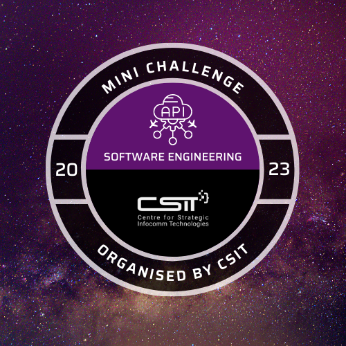

# CSIT Software Engineering Mini Challenge 2023


## Table of Contents

1. [Getting Started](#getting-started)
2. [Documentation](#documentation)
3. [Digital Badge](#digital-badge)

## Getting Started

To run the RESTful API on your local machine, you will require:

### Pre-requisites:

1. [Docker](https://www.docker.com/)

### Starting the FastAPI Server

To start the backend service, we will use the `Dockerfile` provided:

```bash
docker build -t se-mini-challenge .
docker run -p 8080:8080 se-mini-challenge
```

### Making Requests to Server

There are two endpoints provided in this challenge.

1. `GET /flight`
2. `GET /hotel`

Upon running the docker container, you may use [cURL](https://curl.se/) to make requests to the endpoints based on the exposed port `8080`.

`GET /flight`:

```bash
curl "http://127.0.0.1:8080/flight?departureDate=2023-12-10&returnDate=2023-12-16&destination=Frankfurt" | python3 -m json.tool
```

Returns:

```json
[
    {
        "City": "Frankfurt",
        "Departure Date": "2023-12-10",
        "Departure Airline": "US Airways",
        "Departure Price": 1766,
        "Return Date": "2023-12-16",
        "Return Airline": "US Airways",
        "Return Price": 716
    }
]
```

`GET /hotel`:

```bash
curl "http://127.0.0.1:8080/hotel?checkInDate=2023-12-10&checkOutDate=2023-12-16&destination=Frankfurt" | python3 -m json.tool
```

Returns:

```json
[
    {
        "City": "Frankfurt",
        "Check In Date": "2023-12-10",
        "Check Out Date": "2023-12-16",
        "Hotel": "Hotel J",
        "Price": 2959
    }
]
```

## Documentation

All endpoints are automatically documented via [Swagger UI](https://swagger.io/), as part of FastAPI setup.

To access the endpoint documentations, visit [http://127.0.0.1:8080/docs](http://127.0.0.1:8080/docs).

## Digital Badge

Here's the achievement for completing the challenge!




